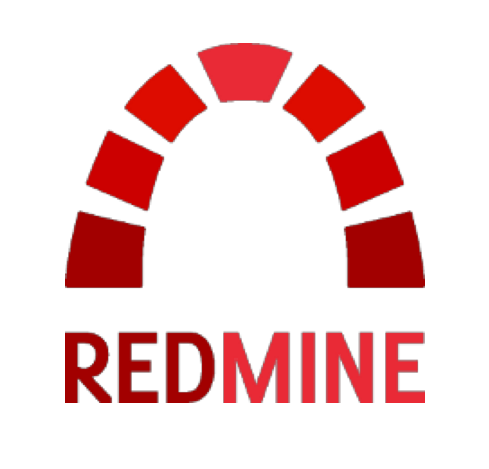

# Hi there 👋

## I am Ismaël

A bit about myself:
- 🔭 I’m currently witch crafting Backends w/ Python
- 🌱 I’m learning Cloud-based solutions for B2B, etc.
- 👯 I’m open to collaboration
- 🤔 I’m looking for help to cook that potion
- 💬 Ask me about best practices
- 📫 How to reach me: [mistaia@proton.me](mailto:mistaia@proton.me)
- ⚡ Fun fact: I can cook 3D potions aswell

## Statistics

## Project's Languages Card

## Languages and Tools

  
  
  
  
  
  
  
  
  
  
  
  
  
  

